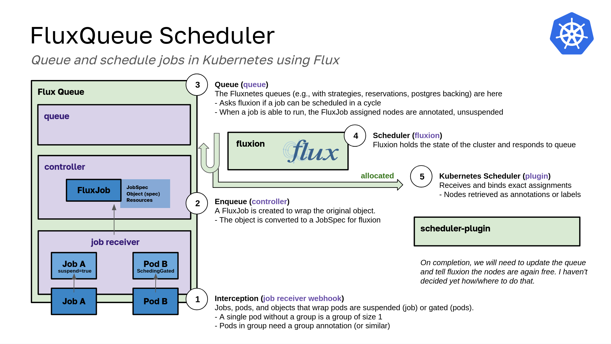

# Fluxqueue

> Under development!



I'm still thinking over improvements to fluxnetes, fluence, and related projects, and this is the direction I'm currently taking. I've been thinking of a design where Flux works as a controller, as follows:

1. The controller has an admission webhook that intercepts jobs and pods being submit. For jobs, they are suspended. For all other abstractions, [scheduling gates](https://kubernetes.io/blog/2022/12/26/pod-scheduling-readiness-alpha/) are used.
2. The jobs are wrapped as `FluxJob` and parsed into Flux Job specs and passed to a part of the controller, the Flux Queue.
3. The Flux Queue, which runs in a loop, moves through the queue and interacts with a Fluxion service to schedule work.
4. When a job is scheduled, it is unsuspended and/or targeted for the fluxqueue custom scheduler plugin that will assign exactly to the nodes it has been intended for.
5. We will need an equivalent cleanup process to receive when pods are done, and tell fluxion and update the queue. Likely those will be done in the same operation.

This project comes out of [fluxqueue](https://github.com/converged-computing/fluxqueue), which was similar in design, but did the implementation entirely inside of Kubernetes. fluxqueue was a combination of Kubernetes and [Fluence](https://github.com/flux-framework/flux-k8s), both of which use the HPC-grade pod scheduling [Fluxion scheduler](https://github.com/flux-framework/flux-sched) to schedule pod groups to nodes. For our queue, we use [river](https://riverqueue.com/docs) backed by a Postgres database. The database is deployed alongside fluence and could be customized to use an operator instead.

**Important** This is an experiment, and is under development. I will change this design a million times - it's how I tend to learn and work. I'll share updates when there is something to share. It deploys but does not work yet!
See the [docs](docs) for some detail on design choices.

## Design

### Containers

Fluxqueue builds three primary containers:

 - `ghcr.io/converged-computing/fluxqueue`: contains the webhook and operator with a flux queue for pods and groups that interacts with fluxion
 - `ghcr.io/converged-computing/fluxqueue-scheduler`: (TBA) will provide a simple scheduler plugin
 - `ghcr.io/converged-computing/fluxqueue-postgres`: holds the worker queue and provisional queue tables

And we use `ghcr.io/converged-computing/fluxion` for the fluxion service.

### Choices

- **Duration of job comes from Kubernetes** Right now, we don't allow a special or different duration to be given to Fluxion. Any duration or deletion needs to come from Kubernetes first, by way of an object deletion. Otherwise we would need to orchestrate deletion from the cluster and Fluxion, and it's easier to ask the user to delete with a job duration or other mechanism.

## Deploy

Create a kind cluster. You need more than a control plane.

```bash
kind create cluster --config ./examples/kind-config.yaml
```

Install the certificate manager:

```bash
kubectl apply -f https://github.com/cert-manager/cert-manager/releases/download/v1.13.1/cert-manager.yaml
```

Then you can deploy as follows:

```bash
./hack/quick-build-kind.sh
```

You'll then have the fluxqueue service running, a postgres database (for the job queue), along with (TBA) the scheduler plugins controller, which we
currently have to use PodGroup.

```bash
$ kubectl get pods -n fluxqueue-system
NAME                                                 READY   STATUS    RESTARTS   AGE
fluxqueue-chart-controller-manager-6dd6f95c6-z9qdk   0/1     Running   0          9s
postgres-5dc8c6b49d-llv2s                            0/1     Running   0          9s
```

You can then create a job or a pod (note that only pod is fully implemented, job coming soon):

```bash
kubectl apply -f test/job.yaml
kubectl apply -f test/pod.yaml
```

Which will currently each be suspended (job) or schedule gated (pod) to prevent scheduling. A FluxJob to wrap them is also created:

```bash
$ kubectl get fluxjobs.jobs.converged-computing.org 
NAME      AGE
job-pod   4s
pod-pod   6s
```

Here is where we see the pod moving through the queue, getting sent to Fluxion to schedule, and then being ungated.

```bash
$ kubectl logs -n fluxqueue-system fluxqueue-controller-manager-5564dc7c9-4fjkx 
```

<details>

<summary> Controller Manager Log </summary>

```console
2025/01/10 07:21:03 🦩️ starting client (127.0.0.1:4242)...
Number nodes  2
Skipping control plane node  kind-control-plane

📦️ kind-worker
      allocated cpu: 1
      available cpu: 15
      allocated mem: 1193279488
      available mem: 61682343936
       running pods: 8

2025-01-10T07:21:03Z    INFO    fluxqueue       match policy    {"Policy": "lonode"}
2025-01-10T07:21:03Z    INFO    fluxqueue       ⭐️ Init cluster status  {"Status": "INIT_SUCCESS"}
2025-01-10T07:21:03Z    INFO    controller-runtime.webhook      Registering webhook     {"path": "/mutate-v1-sidecar"}
2025-01-10T07:21:03Z    INFO    setup   starting manager
2025-01-10T07:21:03Z    INFO    controller-runtime.metrics      Starting metrics server
2025-01-10T07:21:03Z    INFO    setup   disabling http/2
2025-01-10T07:21:03Z    INFO    controller-runtime.webhook      Starting webhook server
2025-01-10T07:21:03Z    INFO    setup   disabling http/2
2025-01-10T07:21:03Z    INFO    starting server {"name": "health probe", "addr": "[::]:8081"}
2025-01-10T07:21:03Z    INFO    controller-runtime.certwatcher  Updated current TLS certificate
2025-01-10T07:21:03Z    INFO    controller-runtime.webhook      Serving webhook server  {"host": "", "port": 9443}
2025-01-10T07:21:03Z    INFO    controller-runtime.certwatcher  Starting certificate watcher
I0110 07:21:03.973120       1 leaderelection.go:254] attempting to acquire leader lease fluxqueue-system/b321c34b.converged-computing.org...
2025-01-10T07:21:04Z    INFO    controller-runtime.metrics      Serving metrics server  {"bindAddress": ":8443", "secure": true}
I0110 07:21:20.494678       1 leaderelection.go:268] successfully acquired lease fluxqueue-system/b321c34b.converged-computing.org
2025-01-10T07:21:20Z    DEBUG   events  fluxqueue-controller-manager-5564dc7c9-4fjkx_20ecc1fb-82f4-45d5-b074-3a6f9fc8ad6e became leader     {"type": "Normal", "object": {"kind":"Lease","namespace":"fluxqueue-system","name":"b321c34b.converged-computing.org","uid":"b4bd2847-851a-44d1-976f-757f50d4ad4b","apiVersion":"coordination.k8s.io/v1","resourceVersion":"21215"}, "reason": "LeaderElection"}
2025-01-10T07:21:20Z    INFO    Starting EventSource    {"controller": "fluxjob", "controllerGroup": "jobs.converged-computing.org", "controllerKind": "FluxJob", "source": "kind source: *v1alpha1.FluxJob"}
2025-01-10T07:21:20Z    INFO    Starting Controller     {"controller": "fluxjob", "controllerGroup": "jobs.converged-computing.org", "controllerKind": "FluxJob"}
2025-01-10T07:21:20Z    INFO    Starting workers        {"controller": "fluxjob", "controllerGroup": "jobs.converged-computing.org", "controllerKind": "FluxJob", "worker count": 1}
2025-01-10T07:21:45Z    INFO    webhook Enqueue pod     {"Name": "pod", "Namespace": "default"}
2025-01-10T07:21:45Z    INFO    webhook received pod and added gate     {"Name": "pod"}
2025-01-10T07:21:45Z    INFO    submit  Creating flux job       {"Namespace": "default", "Name": "pod-pod"}
2025-01-10T07:21:45Z    INFO    submit  Created flux job        {"Namespace": "default", "Name": "pod-pod"}
2025-01-10T07:21:45Z    INFO    fluxqueue       🌀 Event received by FluxJob controller!
2025-01-10T07:21:45Z    INFO    fluxqueue       Request:        {"req": {"name":"pod-pod","namespace":"default"}}
2025-01-10T07:21:45Z    INFO    fluxqueue       Found FluxJob   {"Name": "pod-pod", "Namespace": "default", "Status": ""}
2025-01-10T07:21:45Z    INFO    fluxqueue       Preparing to submit FluxJob     {"Namespace": "default", "Name": "pod-pod"}
2025-01-10T07:21:45Z    INFO    webhook Admission or new or seen pod success.
false
2025-01-10T07:21:45Z    INFO    fluxqueue       Enqueue for job was successful  {"Namespace": "default", "Name": "pod-pod"}
2025-01-10T07:21:45Z    INFO    fluxqueue       Job was added to pending        {"Namespace": "default", "Name": "pod-pod"}
I0110 07:21:45.357258       1 queue.go:277] [0xc000766330]
2025-01-10T07:21:45Z    INFO    worker  [WORK] Asking Fluxion running for job   {"Namespace": "default", "Name": "pod", "Args": {"jobspec":"attributes:\n  system: {}\nresources:\n- count: 1\n  type: node\n  with:\n  - count: 1\n    label: pod\n    type: slot\n    with:\n    - count: 1\n      type: core\ntasks:\n- command:\n  - echo\n  - default\n  - pod\n  count:\n    per_slot: 1\n  slot: pod\nversion: 1\n","object":null,"name":"pod","namespace":"default","flux_job_name":"pod-pod","type":"0","reservation":0,"duration":0,"size":1,"nodes":""}}
2025/01/10 07:21:45 🦩️ starting client (127.0.0.1:4242)...
attributes:
  system: {}
resources:
- count: 1
  type: node
  with:
  - count: 1
    label: pod
    type: slot
    with:
    - count: 1
      type: core
tasks:
- command:
  - echo
  - default
  - pod
  count:
    per_slot: 1
  slot: pod
version: 1

allocation:"{\"graph\": {\"nodes\": [{\"id\": \"3\", \"metadata\": {\"type\": \"core\", \"id\": 0, \"rank\": -1, \"exclusive\": true, \"paths\": {\"containment\": \"/cluster0/0/kind-worker1/core0\"}}}, {\"id\": \"2\", \"metadata\": {\"type\": \"node\", \"basename\": \"kind-worker\", \"id\": 1, \"rank\": -1, \"paths\": {\"containment\": \"/cluster0/0/kind-worker1\"}}}, {\"id\": \"1\", \"metadata\": {\"type\": \"subnet\", \"basename\": \"\", \"id\": 0, \"rank\": -1, \"paths\": {\"containment\": \"/cluster0/0\"}}}, {\"id\": \"0\", \"metadata\": {\"type\": \"cluster\", \"id\": 1, \"rank\": -1, \"paths\": {\"containment\": \"/cluster0\"}}}], \"edges\": [{\"source\": \"2\", \"target\": \"3\"}, {\"source\": \"1\", \"target\": \"2\"}, {\"source\": \"0\", \"target\": \"1\"}]}}\n" jobid:1 overhead:0.0003170967
2025-01-10T07:21:45Z    INFO    worker  Parsing fluxion nodes   {"Nodes": [{"id":"3","metadata":{"type":"core","id":0,"rank":-1,"basename":"","exclusive":true,"paths":{"containment":"/cluster0/0/kind-worker1/core0"}}},{"id":"2","metadata":{"type":"node","id":1,"rank":-1,"basename":"kind-worker","exclusive":false,"paths":{"containment":"/cluster0/0/kind-worker1"}}},{"id":"1","metadata":{"type":"subnet","id":0,"rank":-1,"basename":"","exclusive":false,"paths":{"containment":"/cluster0/0"}}},{"id":"0","metadata":{"type":"cluster","id":1,"rank":-1,"basename":"","exclusive":false,"paths":{"containment":"/cluster0"}}}]}
2025-01-10T07:21:45Z    INFO    worker  Allocation response     {"Nodes": ["kind-worker"]}
2025-01-10T07:21:45Z    INFO    fluxqueue       Updated FluxJob {"Name": "pod-pod", "Namespace": "default", "Status": "statusSubmit"}
2025-01-10T07:21:45Z    INFO    fluxqueue       🌀 Event received by FluxJob controller!
2025-01-10T07:21:45Z    INFO    fluxqueue       Request:        {"req": {"name":"pod-pod","namespace":"default"}}
2025-01-10T07:21:45Z    INFO    fluxqueue       Found FluxJob   {"Name": "pod-pod", "Namespace": "default", "Status": "statusSubmit"}
{"metadata": {"labels": {"fluxqueue/fluxion-nodes": "kind-worker"}}}
2025-01-10T07:21:45Z    INFO    webhook Enqueue pod     {"Name": "pod", "Namespace": "default"}
2025-01-10T07:21:45Z    INFO    webhook Admission or new or seen pod success.
2025-01-10T07:21:45Z    INFO    webhook Enqueue pod     {"Name": "pod", "Namespace": "default"}
2025-01-10T07:21:45Z    INFO    webhook Admission or new or seen pod success.
2025-01-10T07:21:45Z    INFO    worker  Success ungating pod    {"Namespace": "default", "Name": "pod"}
2025-01-10T07:21:45Z    INFO    worker  [WORK] nodes allocated for job  {"JobId": 1, "Nodes": ["kind-worker"], "Namespace": "default", "Name": "pod"}
```

</details>


And the output from the scheduler plugin:

```bash
I0110 07:21:45.377076       1 scheduler.go:65] "PreFilter received contender pod" pod="default/pod"
I0110 07:21:45.377102       1 scheduler.go:93] "PreFilter node assignment" pod="default/pod" node="kind-worker"
I0110 07:21:45.377158       1 scheduler.go:105] "Filter received pod assignment" pod="default/pod" node="kind-worker"
```

And of course the pod running on the node.

```bash
NAME   READY   STATUS    RESTARTS   AGE    IP            NODE          NOMINATED NODE   READINESS GATES
pod    1/1     Running   0          119s   10.244.1.40   kind-worker   <none>           <none>
```

Next I'll finish up job (not a lot to do) and work on edge cases of cancel to Fluxion, etc.

## Development

### Debugging Postgres

It is often helpful to shell into the postgres container to see the database directly:

```bash
kubectl exec -n fluxqueue-system -it postgres-597db46977-9lb25 bash
psql -U postgres

# Connect to database 
\c

# list databases
\l

# show tables
\dt

# test a query
SELECT group_name, group_size from pods_provisional;
```

### TODO

- [ ] For cancel, we would issue a cancel for every pod associated with a job. How can we avoid that (or is that OK?)
- [ ] we will eventually need another mechanism to move schedule queue aside from new submission
- [ ] River is task based, so the entire concept of a loop is not relevant. We are asking flux asyncronously. The schedule loop, in that it kicks of different river jobs, isn't actually a loop - they run in sync, potentially. 
   - So the reservation strategy doesn't make sense because there is no "end" point.
   - Currently I'm just going to set the reservationDepth to 0
- Reservations notes:
 - We have a queue that sends jobs to the scheduler
 - The scheduler does everything that it can, and then it starts reserving things
 - Reservations block off resources and give an estimated start time.
 - Reservations are cleared after the loop.
 - If reservation set to true, it will keep looking for earliest time in future.
 - Reservations are saving state of those jobs for the scheduler JUST during the loop
 - The reservations are cleared out after the loop.
- [ ] scheduleAt can be used to AskFlux in the future
- [ ] Nodes that are currently assigned need to be taken into account
   - Right now they aren't included in resources, but instead should be "given" to Fluxion.
   - Can we use the bypass that I used for the container scheduler?
   - Analogous to restarting cluster when jobs already running
   - Resource representation of what is running gets sent back to flux-sched.
   - [UpdateAllocate](https://github.com/flux-framework/fluxion-go/blob/bbe5b38ff747eba76e4eda8205a7bfba5f6aee82/pkg/fluxcli/reapi_cli.go#L206) 
   - make up job ids
   - take system / operator pods that are running, convert into JGF, and then figure out which resources each are running on. 
   - at end of loop need to go through jobs, for those that aren't scheduled cancel.
- [ ] kubectl plugin to get fluxion state?

## License

HPCIC DevTools is distributed under the terms of the MIT license.
All new contributions must be made under this license.

See [LICENSE](https://github.com/converged-computing/cloud-select/blob/main/LICENSE),
[COPYRIGHT](https://github.com/converged-computing/cloud-select/blob/main/COPYRIGHT), and
[NOTICE](https://github.com/converged-computing/cloud-select/blob/main/NOTICE) for details.

SPDX-License-Identifier: (MIT)

LLNL-CODE- 842614
